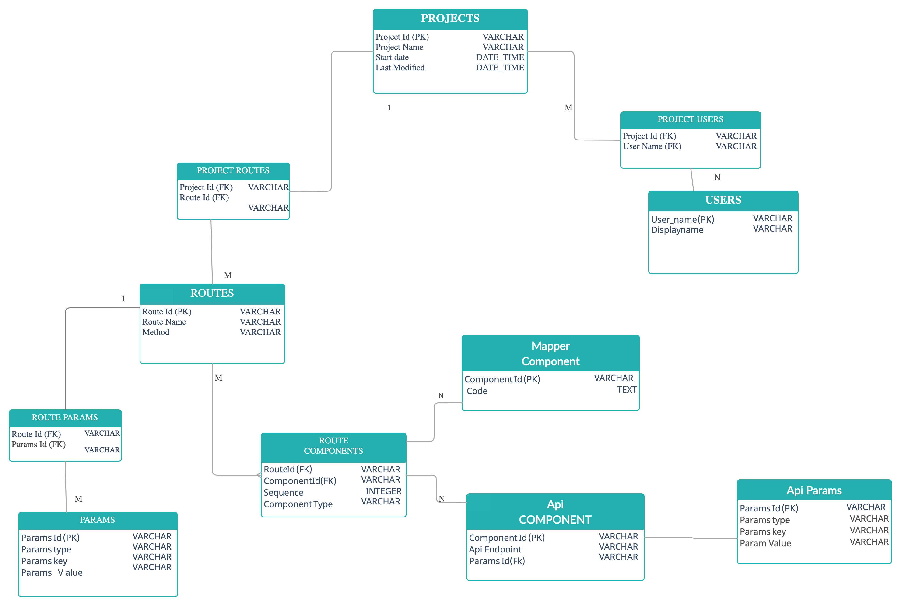

# **FireBackOps** 

FireBackOps is an application designed to help developers in bringing backend servers to life with the minimum amount of hassle and the least number of written code lines. It provides an easy-to-use UI wherein a developer can collaborate and create custom backend servers with just a few clicks and the fabricated server is directly pushed to their github for sharing, testing and deployment. 

The developer doesn't have to worry about creating the folders\files and only needs to provide the application with the routes, logic ,API calls or any kind of storage that they want the server to have. Rest all is taken care of by the application.


## Creating custom server
* Choose the option for a new project
* Specify a name for the project
* Create custom routes by entering url, methods and endpoints 
* Specify API calls and mapper functions to be implemented in specific routes
* Choose any storage or memory cache

Voila! The server is ready to run and the entire folder structure with all the relevant files are pushed to github

## Technology stack used
* Node.js
* Express

## Technical overview

The application enables multiple users to collaborate on a project in an uncomplicated environment. Here is the **ER-DIAGRAM** that the project uses at its core to store users, projects and their corresponding routes and logic.



Github authentication is required by the application to be able to push the server to developer's github repository.
## How to setup on local

Clone the branch on your local and run :

```
npm install 
```
To start the server run :

```
npm start
```

## How to contribute

Development is ongoing, and the development team, as well as other volunteers, can freely work in their own branches and submit pull requests when features or bug fixes are ready.

### Version strategy
Version numbers are following **major.minor.patch** semantics.

### Branches
There are 3 types of branches in this repository:

* master: Stable, contains the latest version of the latest major.minor release.
* maintenance: Stable, contains the latest version of previous releases, which are still under active maintenance. Format: <version>-maint
* development: Unstable, contains new code for planned releases. Format: <version>-dev

Maintenance branches are there for bug fixes only, please submit new features against the development branch with the highest version.

### Naming Branches

The naming convention to be followed for branches:

```
token/branch-name-by-hyphen
```
#### Token

* feat — A feature branch
* bugfix — A bugfix branch
* chore — Cleaning up / organizing the code
* wip — Branched out for some WIP(Work in Progress) stuff that has to be pushed

Avoid long descriptive names. It is recommended to use all lower caps letters and hyphen (-) to separate words in branch name.

**E.g.: feat/authentication**

### Raising Pull Requests
The pull requests should have the following two components

1. Title
* For a single commit, the title is the subject line of the commit message. Otherwise, the title should summarize the set of commits.
2. Description
* Must state the why and the how for the change: Usually this is the body of your commit message.
* Must explain the purpose of the PR, e.g.: feedback for an initial implementation,request for comment,ready to merge.
* Explain any context: is it part of a greater set of changes? are any concurrent PRs (in other repositories) dependent on this PR?
* State what testing has been performed

### Login with Github
Add your Github Organization `CLIENT_ID`,   `CLIENT_SECRET` and `JWT_SECRET` in your `.env` file
## License

